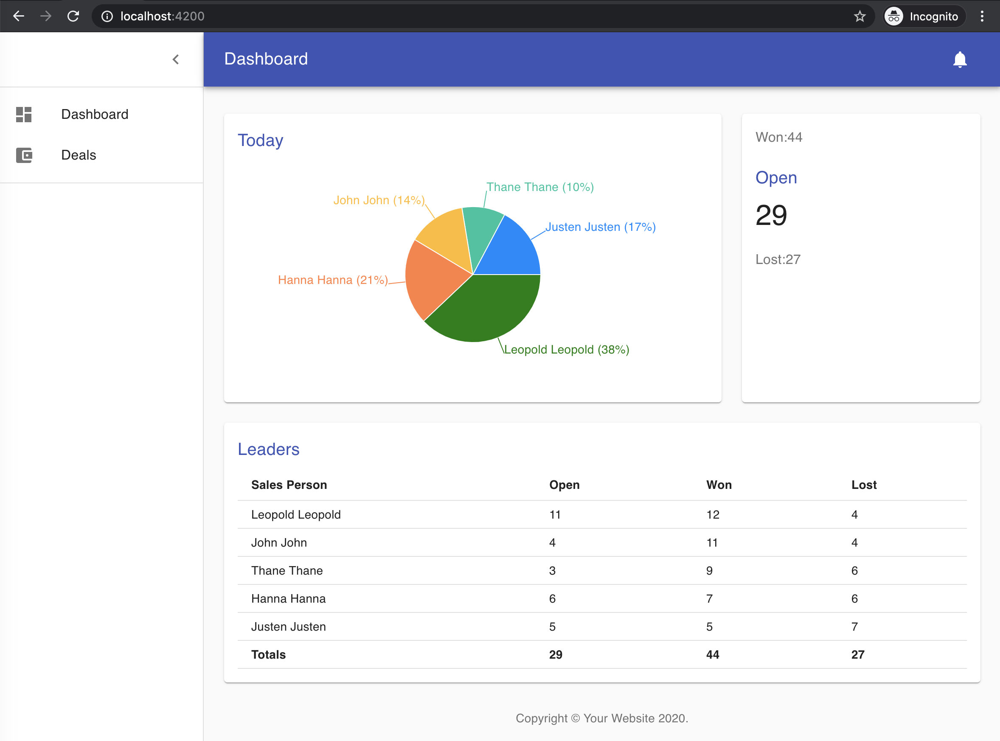

## Leaderboard

Sample project to display won/open leaders using the following:

- React (with Hooks)
- Material-UI
- Recharts

Requires:

- NodeJS 14 (lower version may work)
- NPM 6 (lower version may work)

### To clone

    git clone https://github.com/nangchan/boards.git

### To install

    cd boards
    npm install

### To run the app

    npm start

[visit http://localhost:4200/](http://localhost:4200/)

### To run the tests

    npm test

## To generate dependency graph

    npm run dep-graph

## Further help

Visit the [Nx Documentation](https://nx.dev) to learn more.
